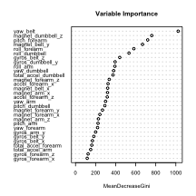

### Introduction
The goal of this study is to train a model to correctly identify "classes" in which barbell lifts are performed. The dataset (obtained from <http://groupware.les.inf.puc-rio.br/har>) is comprised of 93 variables, mostly accelerometer measurements of participants performing barbell lifts in 5 different ways (classes). 

### Setup
We will be using the `caret` and the `randomForest` package for this study:

```r
require(caret)
require(randomForest)
```

### Data Cleaning
First we do some cleaning on our dataset. Here, we remove the first 7 variables used for identifying the observation, any variables that are incomplete (columns containing `NA` entries), and any variables that are not numeric.

```r
data <- read.csv("pml-training.csv")
classe <- data$classe

# Cleaning
data <- data[,-c(1:7)]
data <- data[,colSums(is.na(data))==0]
data <- data[,sapply(data, is.numeric)]
numData <- cbind(data, classe)
```

### Model Training
We split the dataset into 70% training and 30% testing. Our first model is constructed using random forests because 1) cross-validation is built into the training method since bootstrapping is used for multiple trees, 2) random forests work well for larger numbers of observations (there are 13737 observations in the training set).

Our first model will be trained using the cleaned dataset containing 53 variables.

```r
# Train model
inTrain <- createDataPartition(numData$classe, p = 0.7, list = FALSE)
training <- numData[inTrain,]
testing <- numData[-inTrain,]
model <- randomForest(classe~., training)

# Test model
pred <- predict(model, testing)
confusionMatrix(pred, testing$classe)
```

```
## Confusion Matrix and Statistics
## 
##           Reference
## Prediction    A    B    C    D    E
##          A 1674   12    0    0    0
##          B    0 1120    8    0    0
##          C    0    7 1018   16    0
##          D    0    0    0  947    6
##          E    0    0    0    1 1076
## 
## Overall Statistics
##                                           
##                Accuracy : 0.9915          
##                  95% CI : (0.9888, 0.9937)
##     No Information Rate : 0.2845          
##     P-Value [Acc > NIR] : < 2.2e-16       
##                                           
##                   Kappa : 0.9893          
##  Mcnemar's Test P-Value : NA              
## 
## Statistics by Class:
## 
##                      Class: A Class: B Class: C Class: D Class: E
## Sensitivity            1.0000   0.9833   0.9922   0.9824   0.9945
## Specificity            0.9972   0.9983   0.9953   0.9988   0.9998
## Pos Pred Value         0.9929   0.9929   0.9779   0.9937   0.9991
## Neg Pred Value         1.0000   0.9960   0.9983   0.9966   0.9988
## Prevalence             0.2845   0.1935   0.1743   0.1638   0.1839
## Detection Rate         0.2845   0.1903   0.1730   0.1609   0.1828
## Detection Prevalence   0.2865   0.1917   0.1769   0.1619   0.1830
## Balanced Accuracy      0.9986   0.9908   0.9937   0.9906   0.9971
```

Here, we create a second model in which we remove highly correlated variables. The cutoff correlation value that we will use to characterize variables as highly correlated will be set as 0.75.

```r
# Create another model with less variables
# Remove highly correlated variables (remove >= 0.75)
corrMatrix <- cor(data)
highCorr <- findCorrelation(corrMatrix, cutoff = 0.75)
lowCorrData <- data[,-highCorr]
lowCorrData <- cbind(lowCorrData, classe)

# Train model
inTrain2 <- createDataPartition(lowCorrData$classe, p = 0.7, list = FALSE)
training2 <- lowCorrData[inTrain2,]
testing2 <- lowCorrData[-inTrain2,]
model2 <- randomForest(classe~., training2)

# Test model
pred2 <- predict(model2, testing2)
confusionMatrix(pred2, testing2$classe)
```

```
## Confusion Matrix and Statistics
## 
##           Reference
## Prediction    A    B    C    D    E
##          A 1671    2    0    0    0
##          B    3 1133   14    0    0
##          C    0    3 1007   11    1
##          D    0    0    5  950    1
##          E    0    1    0    3 1080
## 
## Overall Statistics
##                                         
##                Accuracy : 0.9925        
##                  95% CI : (0.99, 0.9946)
##     No Information Rate : 0.2845        
##     P-Value [Acc > NIR] : < 2.2e-16     
##                                         
##                   Kappa : 0.9905        
##  Mcnemar's Test P-Value : NA            
## 
## Statistics by Class:
## 
##                      Class: A Class: B Class: C Class: D Class: E
## Sensitivity            0.9982   0.9947   0.9815   0.9855   0.9982
## Specificity            0.9995   0.9964   0.9969   0.9988   0.9992
## Pos Pred Value         0.9988   0.9852   0.9853   0.9937   0.9963
## Neg Pred Value         0.9993   0.9987   0.9961   0.9972   0.9996
## Prevalence             0.2845   0.1935   0.1743   0.1638   0.1839
## Detection Rate         0.2839   0.1925   0.1711   0.1614   0.1835
## Detection Prevalence   0.2843   0.1954   0.1737   0.1624   0.1842
## Balanced Accuracy      0.9989   0.9956   0.9892   0.9921   0.9987
```

This model cuts down on training time with only 32 variables and has the comparable results and performance as the first model on the testing set. Model2 will be used for the rest of the analysis portion of this project. 

### Analysis
Below is a plot of the variable importance.

```r
varImpPlot(model2, cex = 0.5, main = "Variable Importance")
```



As stated earlier, cross-validation is built into the model, since bootstrapping is used for assessing multiple trees. We can obtain the out-of-sample error from our assessment with the testing data subset.


```r
oosError = function(actual, predicted) {
  sum(predicted != actual)/length(actual)
}

oos <- oosError(pred2, testing2$classe)
percent <- round(oos*100, 2)
```
The out-of-sample error rate for our model is *0.76%*. Yay :D

### Assignment Portion
This portion of the project predicts the values of the `pml-testing.csv` dataset and creates text files for submission.

```r
# Predict classe of the testing set
testData <- read.csv("pml-testing.csv")
answers <- predict(model2, testData)
answers <- as.character(answers)

# Write answers to text files
pml_write_files = function(x){
  n = length(x)
  for(i in 1:n){
    filename = paste0("problem_id_",i,".txt")
    write.table(x[i],file=filename,quote=FALSE,row.names=FALSE,col.names=FALSE)
  }
}

pml_write_files(answers)
```
